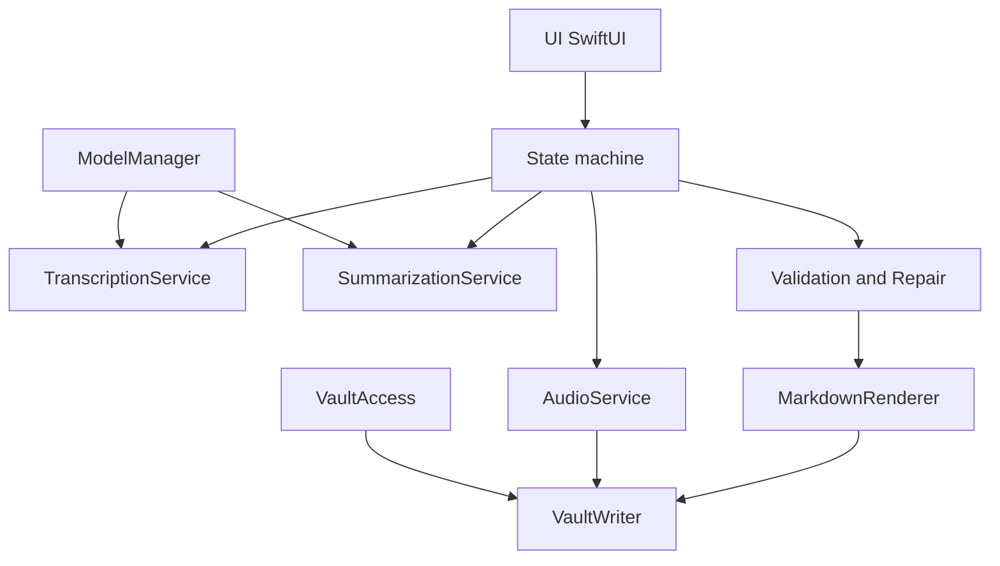

# Minute v1 — Implementation Plan Index

This folder contains an execution-ordered, multi-file implementation plan for the Minute macOS app described in `docs/overview.md`.

## Scope recap (v1)
- Native macOS app (Swift + SwiftUI, macOS 14+ recommended)
- Record mic audio
- Transcribe locally using `whisper.cpp`
- Generate structured meeting note locally using `llama.cpp`
- Write exactly three artifacts into a user-selected Obsidian vault:
  - Markdown note: `Meetings/YYYY/MM/YYYY-MM-DD HH.MM - <Title>.md`
  - WAV audio: `Meetings/_audio/YYYY-MM-DD HH.MM - <Title>.wav` (mono, 16 kHz, 16-bit PCM)
  - Transcript markdown: `Meetings/_transcripts/YYYY-MM-DD HH.MM - <Title>.md`

## Execution order
1. `01-foundation-and-project-structure.md`
2. `02-vault-access-and-settings.md`
3. `03-state-machine-and-ui.md`
4. `04-audio-capture-and-wav-export.md`
5. `05-transcription-whisper-integration.md`
6. `06-summarization-llama-integration.md`
7. `07-validation-json-repair-and-markdown-rendering.md`
8. `08-atomic-vault-writing-and-output-contract.md`
9. `09-model-management-downloads-and-storage.md`
10. `10-packaging-sandbox-signing-and-qa.md`

## Architecture at a glance

## Conventions used in the plan
- Prefer Swift Concurrency (`async`/`await`) over callback-heavy APIs.
- Contain OS/system APIs inside services and keep UI “thin”.
- Use explicit types for data boundaries (e.g., decoded JSON schema), and keep rendering deterministic.
- Use `OSLog` for logging and redact sensitive data.

## Decision points (confirm early)
Even though the overview fixes most choices, these are the remaining early decisions that affect implementation details:
- Use **library** integrations for `whisper.cpp` and `llama.cpp` (no bundled CLI executables).
- Audio conversion strategy:
  - Prefer AVFoundation for **capture**.
  - Prefer an `ffmpeg`-based conversion step for **guaranteed** mono 16 kHz 16-bit PCM WAV output across machines.
  - If AVFoundation export proves fully deterministic and always verifies against the contract, `ffmpeg` can be disabled/removed later.
- Minimum macOS version: 13+ is acceptable. (Plan assumes 13+.)
